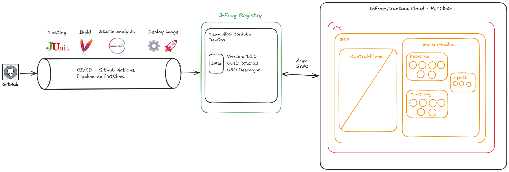
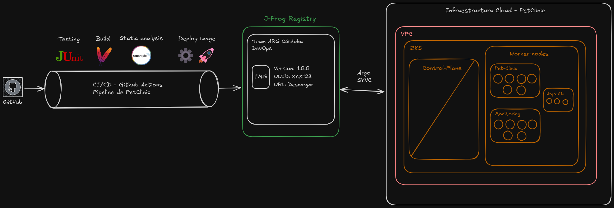

# 🐾 PetClinic Cloud Infrastructure 🚀 | DevOps Bootcamp 2 - CódigoFacilito

Este proyecto es parte del **Bootcamp DevOps 2** de [CódigoFacilito](https://codigofacilito.com/), desarrollado por:

- 👨‍💻 **Kevin Leonel Yanes** [@kyanesdev](https://github.com/kyanesdev)
- 👨‍💻 **Angel Mario Perez** [@mperezgithub](https://github.com/mperezgithub)

El objetivo es automatizar la infraestructura de **PetClinic** en la nube, aplicando prácticas de **Infrastructure as Code (IaC)**, **GitOps**, y **observabilidad** con un flujo CI/CD moderno.

---

## 🗺️ Arquitectura General

#### Light Mode


#### Dark Mode


### 🔄 Flujo CI/CD
1. **GitHub Actions**: Testing (JUnit), Build (Maven), Static Analysis (SonarQube).
2. **Deploy de Imagen**: Publicación en JFrog Artifactory.
3. **ArgoCD Sync**: Automatización de despliegues en EKS.

### ☁️ Infraestructura Cloud
- 🟧 **VPC & EKS**: Orquestación Kubernetes con Terraform.
- 🐾 **PetClinic**: Microservicio desplegado en Kubernetes.
- 📊 **Monitoring Stack**: Grafana, Prometheus, Loki, Tempo, OTEL.
- 🔁 **GitOps con ArgoCD**: Despliegue continuo desde el repo.

----

## 🗂️ Estructura del Proyecto

### Separación de repositorios (Desarrollo - Flujo CI/CD e Infraestructura)

Repositorio Desarrollo - Flujo CI/CD: https://github.com/mperezgithub/fc-devops-mainapp

#### Desarrollo - Flujo CI/CD

```markdown
├── compose.monitor.yml      📊 Configuración de monitoreo Docker
├── compose.yml             🐳 Configuración base de contenedores
├── Dockerfile              📦 Definición de imagen Docker
├── .github/               🤖 Configuraciones de GitHub Actions
│   └── workflows/         📋 Pipeline CI/CD
│       └── pipeline.yaml  🔄 Configuración de flujo de trabajo
├── loadtesting/           📊 Herramientas de pruebas de carga
│   ├── bash/             📝 Scripts de benchmark
│   ├── jmeter/           📊 Pruebas de carga JMeter
│   └── k6/               📊 Pruebas de carga K6
├── tools/                 🛠️ Herramientas de monitoreo
│   ├── loki/             📝 Configuración Loki
│   ├── prometheus/       📊 Configuración Prometheus
│   ├── tempo/            ⏱️ Configuración Tempo
│   └── otel-collector/   🔄 Configuración OpenTelemetry
└── src/                   📁 Código fuente de la aplicación
    ├── main/             📂 Código principal
    │   ├── java/         📂 Lógica de negocio
    │   └── resources/    📂 Recursos y configuraciones
    └── test/             📂 Pruebas unitarias
```

## 📋 Pipeline CI/CD
--------------

```markdown
🔄 jobs:
  build-test-analyze:
    📦 runs-on: ubuntu-latest
    📦 steps:
      - Checkout code          📥 Descarga del código
      - Configure AWS         📦 Configuración de credenciales AWS
      - Setup Java            ☕ Instalación de JDK 21
      - Cache Maven           📦 Caché de dependencias Maven
      - Run Tests             🧪 Ejecución de pruebas JUnit
      - Sonar Analysis       📊 Análisis de código
      - Build App             📦 Compilación de la aplicación
      - Docker Buildx        🐳 Configuración de Docker Buildx
      - Build & Push Image   📦 Construcción y despliegue de imagen
```

#### Infraestructura

```markdown
├── docs/                    📄 Documentación del proyecto
├── k8s/                     🐳 Configuraciones Kubernetes
│   ├── argocd/             🔄 ArgoCD configurations
│   ├── monitoring/         📊 Componentes de monitoreo
│   │   ├── grafana-*      📈 Dashboards Grafana
│   │   └── prometheus-*    ⚡ Prometheus configs
│   ├── mysql/              🐬 Configuración MySQL
│   └── petclinic/          🏥 Aplicación PetClinic
├── kind/                   🌟 Configuración Kind cluster
└── terraform/             🛠️ Infraestructura como código
    ├── environments/       🌍 Entornos de desarrollo
    └── modules/           🧩 Módulos reutilizables
```

---

## 🛠️ Tecnologías Utilizadas

| Herramienta         | Función                          |
|---------------------|----------------------------------|
| 🐳 Docker            | Contenerización de servicios     |
| 📦 Helm              | Gestión de paquetes Kubernetes   |
| ☸️ Kubernetes (EKS)  | Orquestación de contenedores     |
| 🔧 Terraform         | Infraestructura como código (IaC)|
| 📈 Prometheus & Grafana | Observabilidad & Monitoreo   |
| 📝 ArgoCD            | GitOps (CD)                      |
| 🔄 GitHub Actions    | Pipeline CI/CD                   |
| 📦 JFrog Artifactory | Registro de imágenes             |
| 🧪 JUnit & SonarQube | Testing y análisis estático      |
| 🧪 Localstack        | Emulación de servicios AWS local |

---

## 📝 Comandos Clave

### 🏗️ Desplegar Infraestructura (Terraform)

#### Ambiente de desarrollo (DEV):

```bash
cd terraform/environments/dev
terraform init
terraform apply
```

### 🚀 Desplegar PetClinic (Helm + ArgoCD Sync)

```bash
helmfile apply -f k8s/helmfile.yaml
```

### 📊 Activar Stack de Monitoring

```bash
kubectl apply -f k8s/monitoring/
```

### 🔁 Pruebas Locales (Kind + Localstack)
```bash
kind create cluster --config kind/cluster.yaml
docker-compose up -d --build
```

---

## 🎯 Objetivos de Aprendizaje

- ✅ Aplicar Terraform para Infraestructura Cloud
- ✅ Automatizar despliegues con GitOps & ArgoCD
- ✅ Integrar Observabilidad con Grafana, Prometheus, Loki y Tempo
- ✅ Crear un flujo CI/CD desde GitHub hasta EKS
- ✅ Simular entorno cloud con Localstack y Kind


